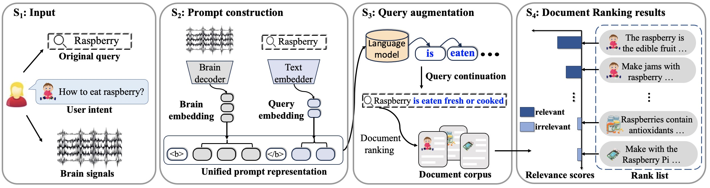

# Query Augmentation by Semantic Decoding from Brain Signals



This is the official repo for our paper ***Query Augmentation by Semantic Decoding from Brain Signals***. 

## Quick Start
We have provided an example dataset to facilitate the replication of experiments. To run the example dataset, you can go into the sub-directory *language_generation/src* and use the following command:

```bash
# preparing data
python main.py -task_name Pereira_$2 -cuda 0 -load_check_point False -model_name $1 -checkpoint_path Pereira_$2_$1_$3 -batch_size 8 -lr 1e-4  -pretrain_lr 1e-3 -pretrain_epochs 1 -wandb none -mode d -dataset_path ../../../../dataset/preprocessed/Pereira/ -pos True -common_data_prefix $1. -random_number $3
# model training and evaluation
python main.py -task_name Pereira_$2 -cuda 0 -load_check_point False -model_name $1 -checkpoint_path Pereira_$2_$1_$3 -batch_size 8 -lr 1e-4  -pretrain_lr 1e-3 -pretrain_epochs 1 -wandb none -mode generation_train -dataset_path ../../../../dataset/preprocessed/Pereira/ -pos True -common_data_prefix $1. -random_number $3
# control evaluation (runing RS Brain with ranking-orient inference)
python main.py -task_name Pereira_$2 -cuda 0 -load_check_point False -model_name $1 -checkpoint_path Pereira_$2_$1_$3 -batch_size 8 -lr 1e-4  -pretrain_lr 1e-3 -pretrain_epochs 10 -wandb none -input_method permutated -mode evaluate -output test_permutated_idf_0.5 -dataset_path ../../../../dataset/preprocessed/Pereira/ -pos True -common_data_prefix $1. -idf_ratio 0.5 -generation_method beam_idf -random_number $3
# control evaluation (runing w/o Brain with ranking-orient inference)
python main.py -task_name Pereira_$2 -cuda 0 -load_check_point False -model_name $1 -checkpoint_path Pereira_$2_$1_$3 -batch_size 8 -lr 1e-4  -pretrain_lr 1e-3 -pretrain_epochs 10 -wandb none -input_method without_brain -mode evaluate -output test_nobrain_idf_0.5 -dataset_path ../../../../dataset/preprocessed/Pereira/ -pos True -common_data_prefix $1. -idf_ratio 0.5 -generation_method beam_idf -random_number $3
# evaluation (runing Brain-Aug with ranking-orient inference)
python main.py -task_name Pereira_$2 -cuda 0 -load_check_point False -model_name $1 -checkpoint_path Pereira_$2_$1_$3 -batch_size 8 -lr 1e-4  -pretrain_lr 1e-3 -pretrain_epochs 10 -wandb none -mode evaluate -output test_idf_0.5 -dataset_path ../../../../dataset/preprocessed/Pereira/ -pos True -common_data_prefix $1. -idf_ratio 0.5 -generation_method beam_idf -random_number $3
```
where *$1* is the participant id, *$2* is the selected model name, *$3* is the number of fold.

To run with [slurm](https://slurm.schedmd.com/documentation.html), you can also use the provided scripts in the sub-directory *language_generation/scripts* (remember to replace the name of conda environment and the path of the sub-directory *language_generation/scripts* according to your settings).

```bash
sh example_all.sh example llama-7b 1
```

To evaluate the model performance, you can refer to the code in *language_generation/src/post_hoc_evaluate.py*

### Installation

This repo is developed with [PyTorch](https://pytorch.org/get-started/locally/). It can be installed manually according to the requirement of platform-specific custom configuration. The recommended commands for installation are:
```bash
# XX.X is a placeholder for cudatoolkit version. It should be specified according to your environment
conda install pytorch torchvision torchaudio cudatoolkit=XX.X -c pytorch 
```
In our experiment, we use torch verison 2.0.1 and cuda verison 11.7.
In addition to PyTorch, we adopt several publicly available packages, which can be installed by
```bash
pip install -r requirements.txt
```

### Model Training
To train the model, you need to special the parameter *-mode* as *training* (only training) or *all* (training and evaluation).
You can specify several hyper parameters according to your requirement, the default parameters for Pereira's dataset, Huth's dataset, and Narratives dataset are provided in *language_generation/scripts/example.sh*, *language_generation/scripts/huth.sh*, and *language_generation/scripts/narratives.sh*, respectively.
The meaning of hyper parameters are listed below:

|  **Parameter**  | **Meaning**  |
|   :----   |   :----   |
| model_name | the selected LLM, choose from {gpt2,gpt2-medium,gpt2-large,gpt2-xl,llama-2} |
| method | only supported *decoding* in the released verison |
| task_name | *{dataset_name}_{participant_name}*, dataset_name selected from *{Pereira,Huth,Narratives}* |
| test_trail_ids | specify the range of test dataset, view the dict *dataset2agrs* in *language_generation/src/config.py* for default setting |
| valid_trail_ids | specify the range of validation dataset, view the dict *dataset2agrs* in *language_generation/src/config.py* for default setting |
| random_number | for cross-validation evaluation, cooperate with parameter *test_trail_ids* and *valid_trail_ids*|
| batch_size | set as 8 in our experiment |
| fmri_pca | how to do data dimensionality reduction, default is *True* |
| cuda | specify the device number |
| layer | not used in the released verison |
| num_epochs | specify the maximum number of training epochs |
| lr | learning rate, set as 1e-4 in our experiment |
| dropout | dropout rate for brain decoder |
| checkpoint_path | path of training checkpoint for saving and downloading |
| load_check_point | whether to load existing checkpoint |
| enable_grad | whether to allow the parameter in LLM updated or not |
| mode | *train*: only training and evaluate in the validation set; *evaluate*: evaluate in the test set; *all*: train and evaluate|
| additional_loss | training with additional loss, not used in the released verison |
| fake_input | training with fake input, not used in the released verison |
| add_end | not used in the released verison |
| context | whether to discard data sample without any text prompt or not |
| roi_selected | roi-based experiment, not used in the released verison |
| project_name | specify the project name for [wandb](https://wandb.ai/site) |
| noise_ratio | not used in the released verison |
| wandb | specify how to sync the experimental in [wandb](https://wandb.ai/site), selected from *{online, offline, none}* |
| generation_method | generation method for the LLM, selected from *{greeddy, beam}* |
| pos | specify whether to use position embedding in the brain decoder |
| output | specify whether to use position embedding in the brain decoder |
| data_spliting | specify how to split the dataset, selected from *{random, cross_story}*, default is *random* |
| brain_model | the based model for the brain decoder, selected from *{mlp,rnn,linear,big_mlp,multi_mlp}* |
| weight_decay | weight decay |
| l2 | weight for l2 regularized loss |
| num_layers | number of layers in the brain decoder |
| evaluate_log | whether to evaluate in the test set for model in each training epoch |
| normalized | whether to normalize the input |
| activation | activation function, selected from *{relu,sigmoid,tanh,relu6}* |
| pretrain_epochs | number of epochs in warm up step |
| pretrain_lr | learning rate in warm up step|
| data_size | maximum training data samples |
| results_path | path to save model results |
| dataset_path | path to the downloaded dataset |
| shuffle_times | permutation times for RS Brain |

### Model Evaluation
To evaluate the model with different prompt input, i.e., Brain-Aug, RS Brain, and LLM, you can specify the parameter *-input_method* as *normal*, *permutated*, *without_brain*, respectively. To test the model performance without any text prompt, you should train and evaluate the model while setting *-input_method* as *without_text*.

After that, you can get output files for different prompt inputs. Then, you can evaluate their performance by runing the python script *language_generation/src/post_hoc_evaluatoion.py* with the path of output files specified.
Refer to *language_generation/src/post_hoc_evaluatoion.py* for example usage:
```bash
python language_generation/src/post_hoc_evaluatoion.py
```

### Dataset
We test our approach on three public fMRI datasets: [Pereira's dataset](https://www.nature.com/articles/s41467-018-03068-4), [Huth's dataset](https://www.nature.com/articles/s41597-023-02437-z), and [Narratives dataset](https://www.nature.com/articles/s41597-021-01033-3). The brief introduction, ethical information, statistics, and useage details of these datasets are provied in our paper.
